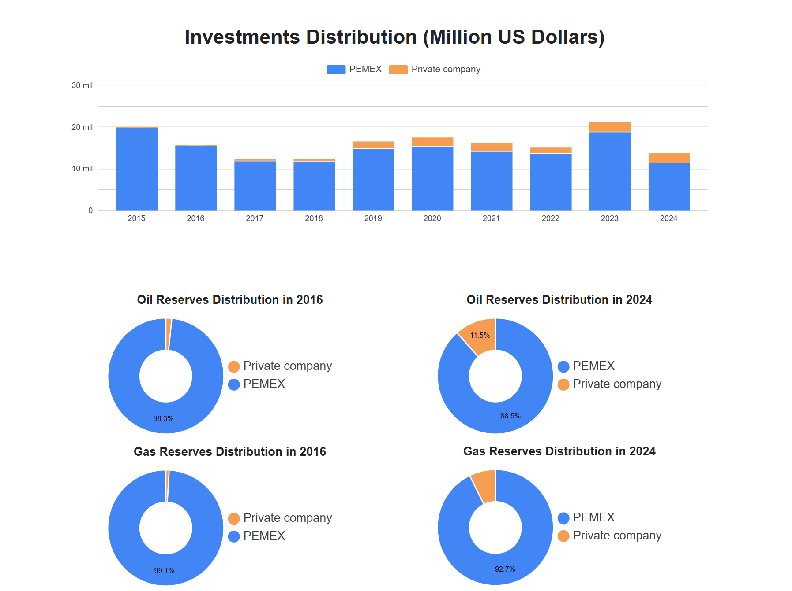
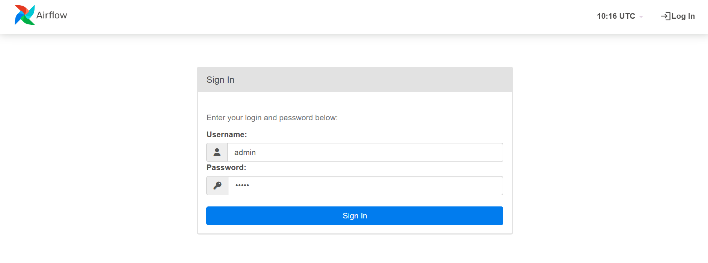
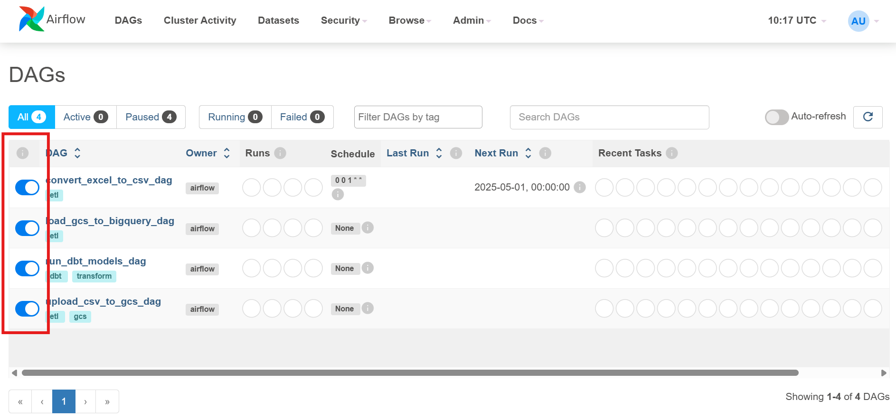
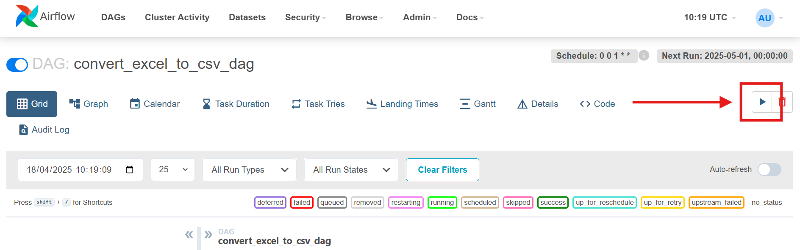
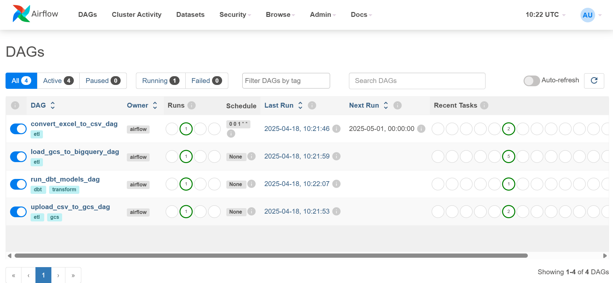

### Hydrocarbond Pipeline and Dashboard

## Problem the Dashboard Solves
In the context of Mexico’s evolving energy sector, it is critical to monitor how investment efforts by public and private stakeholders—particularly PEMEX and private companies—translate into changes in national oil and gas reserves over time. However, decision-makers often face fragmented data sources and lack a centralized, visual overview that connects investment trends with resource ownership outcomes across multiple years. This makes it difficult to:

Evaluate the effectiveness of private sector participation following energy reforms.

Assess investment behavior over time and how it correlates with shifts in oil and gas reserve ownership.

Support policy decisions regarding future investment allocations and strategies to enhance reserve replacement rates.

## How the Dashboard Solves It

This dashboard provides a clear, comparative view of investments and reserves distribution across a key period (2015–2024), enabling users to derive insights at a glance:

**Investment Trends Visualization (Bar Chart)**

Shows the annual distribution of investments (in million USD) between PEMEX and private companies.

Helps identify trends, such as the increasing participation of private investment starting in 2019.

Allows analysts to correlate investment upticks with changes in reserve shares in subsequent years.

**Reserves Distribution Analysis (Donut Charts)**

Compares oil and gas reserve ownership between PEMEX and private companies for two key years: 2016 (pre-reform impact) and 2024 (post-reform impact).

Highlights a notable shift in ownership: for example, private companies’ share in oil reserves grew from 1.7% in 2016 to 11.5% in 2024.

Offers visual proof of the growing influence of private entities in the upstream sector.

**Strategic Decision Support**

Empowers policymakers and analysts to evaluate whether private investment has successfully contributed to reserve growth.

Supports performance reviews of energy reform outcomes.

Informs future investment strategies, regulation frameworks, and incentive design.

## Technologies Used

- **Google Cloud Platform** (GCS, BigQuery)
- **Terraform** for infrastructure-as-code
- **Docker** for full environment reproducibility
- **Airflow** for orchestration
- **dbt** for data modeling
- **Looker Studio** for automated dashboards

## Dashboard Output

Dive into the full interactive dashboard and uncover how investment patterns have influenced Mexico’s oil and gas reserves from 2015 to 2024.
Click the link below to explore the data-driven insights:

[View the Dashboard in Looker Studio](https://lookerstudio.google.com/reporting/96f394c7-6265-4cb6-a82f-764aeec55835/page/7rRHF)

## Instructions to Run

**Initial setup**

1. Clone this GitHub Repository

2. Create a GCP Project and Service Account
    - Create a Google Cloud Project.
    - Enable the Following APIs:
        - BigQuery API
        - Cloud Storage API
    - Create a service account with BigQuery Admin and Storage Admin roles.
    - Download the service account key as JSON.

3. Organize Credentials
    - Place your JSON credential in the "google" folder and name it "google_credentials.json".
    - Replace the fields that reference your project ID, region, bucket_name, bigquery_dataset from the following files:
        - variables.tf
        - dbt_setup.sh
        - entrypoint.sh
        - sources.yml

**Running the project**

1. Run inside the hydrocarbons_dashboard/ root:
    - docker-compose up -d --build

2. Confirm that:
    - A GCS bucket is created for data ingestion.
    - A BigQuery dataset was created.

**Data Ingestion & Processing with Airflow**

1. Open Airflow at:
http://localhost:8080

    - Username: admin
    - Password: admin

2. Toggle all of the available DAGS to activate them:
    - convert_excel_to_csv_dag
    - load_gcs_to_bigquery_dag
    - run_dbt_models_dag
    - upload_csv_to_gcs_dag

3. Click on the convert_excel_to_csv_dag and click the run button
    - Airflow will automatically:
        - Transform the xlsx files into csv files.
        - Load the csv files into your GCS bucket.
        - Load the data from your GCS bucket into your BigQuery dataset.
        - Run the dbt models for data transformation and load the results into your BigQuery datset.

4. Return to the DAGs page and confirm that all DAGs are successful.

**Analytics with Looker Studio**

1. Open Looker Studio.

2. Create a new report connected to your BigQuery datset.

3. Add the following data sources:
    - dash_investments_by_participation
    - dash_reserves_by_participation

4. Used visualizations:
    - Stacked vertical bar chart
    - Donut chart

